<h1>Deux micros-services avec quatre connecteurs Rest-APi, GraphQL, SOAP, GRPC</h1>

Dans ce rapport nous avons connecté deux micro-services avec quetre type de communication synchrone

<h3>Architecture du système distribué</h3>
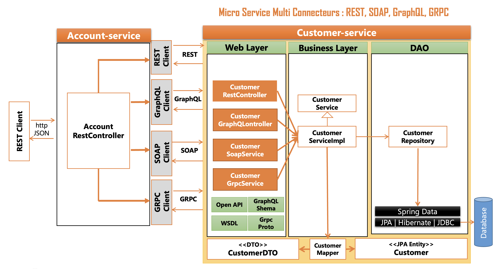

Comme le montre le schéma ci-dessus nous avons deux micros-services le premier est Account-service, le deuxième Customer-service

<ul>
    <li>Dans customer nous avons une entité qui est identifiée par son nom et son mail</li>
    <li>Dans account nous avons une entité qui est identifiée par son mail, son mot de passe et par l'ID du customer</li>
</ul>

L'idée est à chaque fois qu'on affiche un account du premier micro-service on aille chercher le nom du customer du deucième micro-service

<h3>Architecture des project</h3>
<h4>Customer-Service</h4>
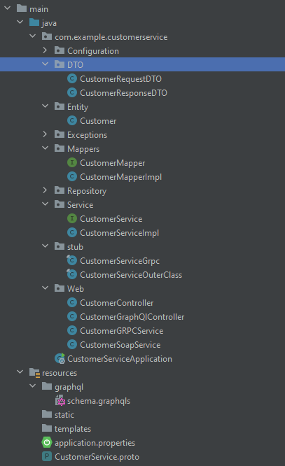
<h4>Account-Service</h4>
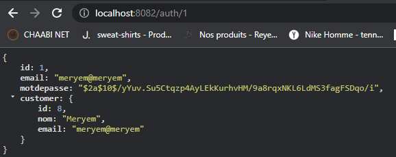

Chaque micro-service respect les bonnes pratiques à savoir

<ul>
    <li>Couche DTO</li>
    <li>Couche Entity</li>
    <li>Couche Repository</li>
    <li>Couche Mapping</li>
    <li>Couche Service</li>
    <li>Couche Web</li>
</ul>

Seul dans la couche service dans Account-service il y a 4 sous-couche pour chaque connecteur entre Account et Customer

<h3>Capture des quatres méthodes de communications</h3>
<h4>REST-API</h4>
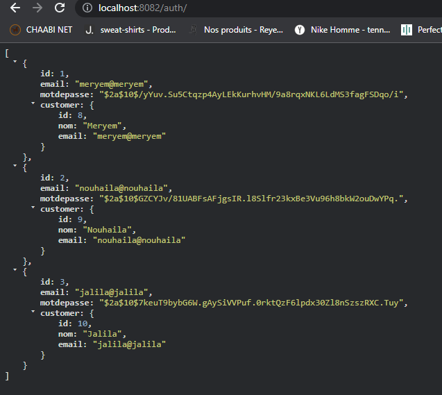
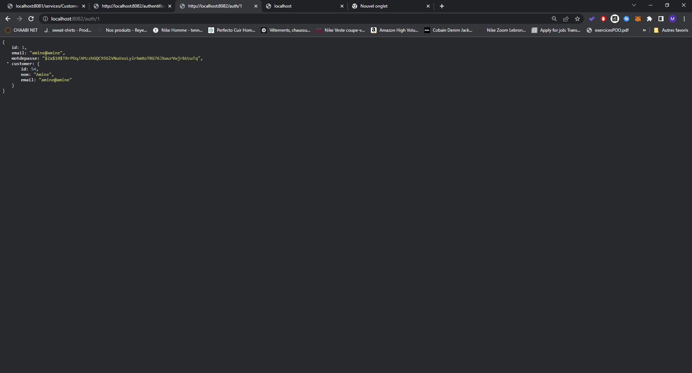
<h4>GraphQl</h4>
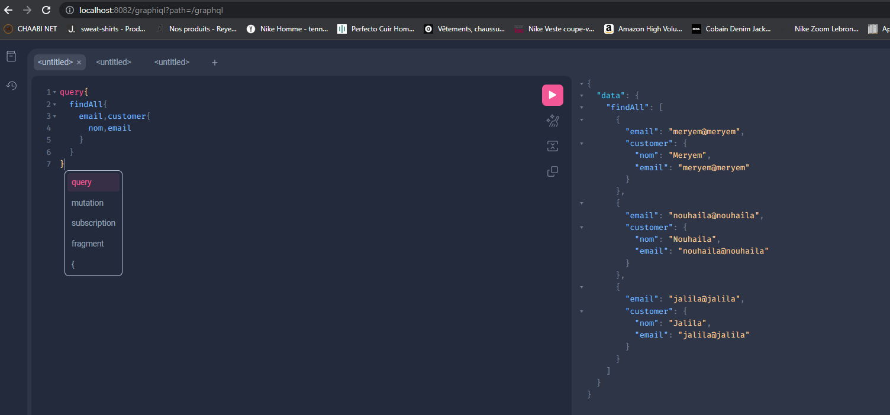
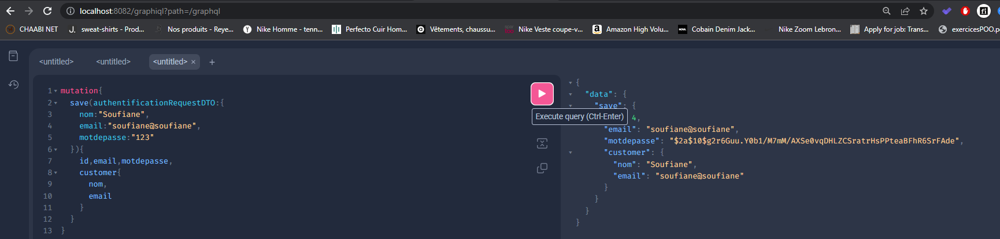
<h4>SOAP</h4>
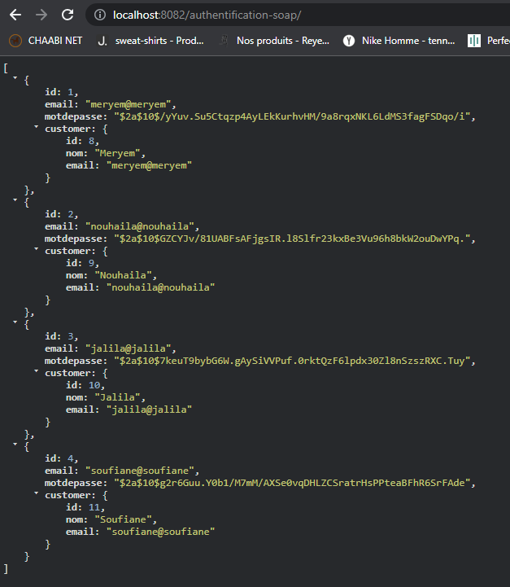
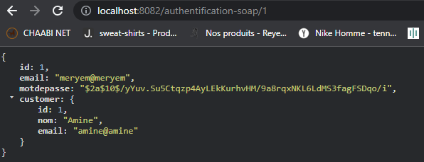
<h4>GRPC</h4>
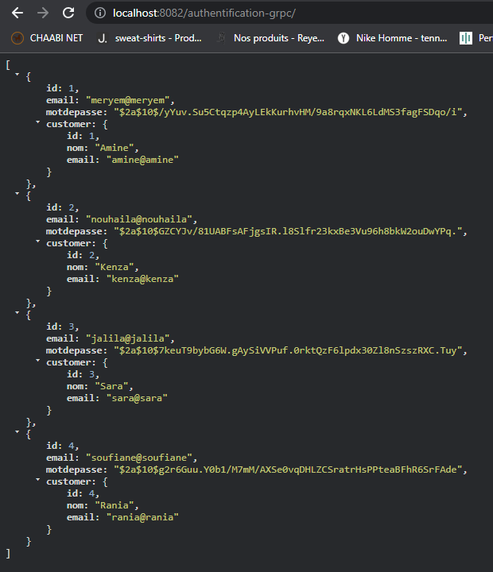
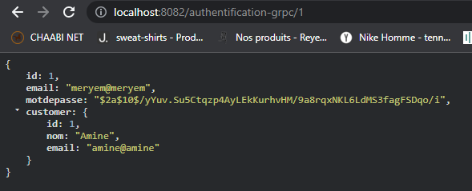
